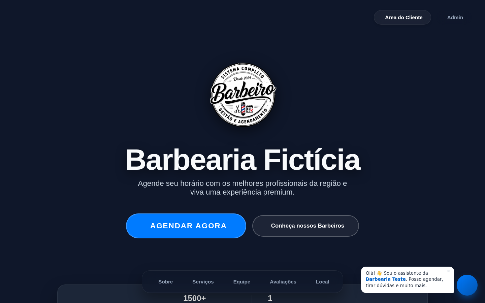
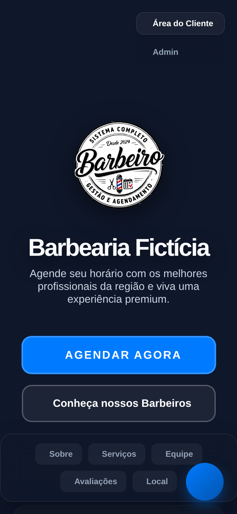
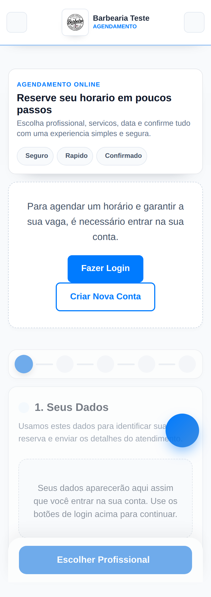
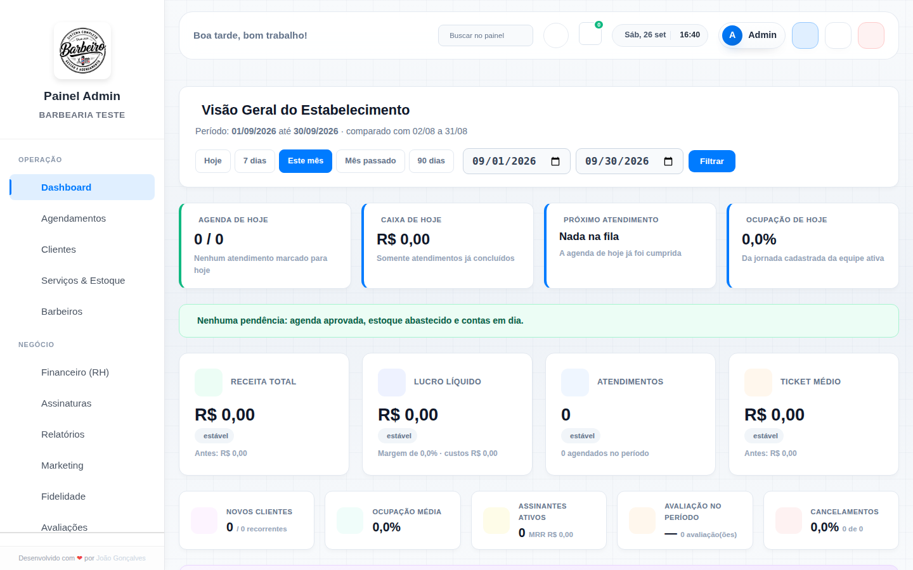

# 8. Avaliação de UX/UI atual

Base: capturas de tela de uma cópia local (desktop 1440 px e celular 390 px), com dados
de exemplo (1 barbeiro, 3 serviços) e **configuração padrão**. Na cópia local o CDN de
ícones estava bloqueado, por isso os ícones não aparecem nas capturas. Isso não é um
defeito de produção, mas mostra a dependência do CDN.

> **Precisa de validação:** a barbearia real pode ter personalizado textos, cores, vídeo e
> logo. A análise estrutural (layout, hierarquia, componentes) vale mesmo assim, porque o
> admin só consegue mudar textos, uma cor e o vídeo.

### Capturas (cópia local, configuração padrão)

| Landing — desktop (primeira dobra) | Landing — celular (primeira dobra) |
|---|---|
|  |  |

| Agendamento — celular (sem login) | Painel admin — desktop |
|---|---|
|  |  |

Página completa (desktop): [img/landing-desktop.png](img/landing-desktop.png).

## 8.1 Site público — diagnóstico

### O que a página transmite hoje

Um **aplicativo escuro genérico**, não uma barbearia. A página inicial parece um painel de
SaaS transformado em site: cartões "de vidro" azul-marinho, pílulas de navegação, números
em destaque, botões arredondados em azul. Nada no visual depende do fato de ser uma barbearia.

### Estrutura atual (ordem das seções)

1. Hero: vídeo de fundo (ou gradiente), logo, título, subtítulo, 2 botões, links "Área do Cliente" e **"Admin"**.
2. Faixa de prova social (nota média, "1500+ clientes", nº de profissionais).
3. Barra de navegação em pílulas (Sobre, Serviços, Equipe, Avaliações, Local).
4. Sobre: texto + 3 contadores animados.
5. Serviços: "Destaques" (até 4 cartões) + planos de assinatura.
6. Equipe: "Barbeiro em destaque" + grade "O time completo".
7. Avaliações destacadas.
8. Chamada final ("Pronto para o próximo nível?").
9. Localização: contato + horários + mapa.
10. Rodapé (termos, privacidade, minha conta, **painel admin**).
11. Widget do chatbot flutuante.

### Problemas por critério

| Critério | Situação atual | Evidência |
|---|---|---|
| **Identidade da marca** | Inexistente. A cor padrão é `#007bff` (azul "Bootstrap"). O logo padrão é o do **produto** ("Sistema Completo Barbeiro — Gestão e Agendamento"), não da barbearia. O título padrão é "Barbearia Fictícia" | captura `landing-desktop-fold`; `lib/config_functions.php` (padrões) |
| **Uso de fotografia** | Nenhuma foto real: não há galeria, fotos de cortes nem do ambiente. Os profissionais aparecem como avatar padrão. Só existe um vídeo de fundo genérico | `index.php` (só `bg_video.mp4` e `default-profile.jpg`) |
| **Hierarquia** | O título ("Barbearia Fictícia") pesa mais que a proposta de valor. Seções com a mesma importância visual; ícones antes de todo título; "Destaques" como H3 com estilo de H2 | `index.php:222`, `:276-294` |
| **Tipografia** | Outfit (títulos) + Inter (texto): combinação neutra de SaaS, sem personalidade. Títulos em peso 800–900 com `letter-spacing` negativo em tudo | `partials/index_style.php:28-29,83` |
| **Espaçamento e composição** | Tudo centralizado em cartões com a mesma largura; ritmo monótono; grandes áreas vazias com um único cartão (equipe com 1 barbeiro repetida duas vezes) | captura `landing-desktop` |
| **Chamadas para ação** | Boas no hero (botão grande, visível no celular). Botão secundário leva à equipe, e não aos serviços/preços. Há 4 CTAs de agendar ao longo da página, todos iguais | `index.php:225-228` |
| **Serviços** | "Destaques" = os **4 serviços mais caros** (critério automático, não editorial), todos com o mesmo ícone genérico. A lista completa exige ir para o agendamento. Sem duração, sem foto | `index.php:100-102`, `:293-320` |
| **Profissionais** | "Barbeiro em destaque" por nota média expõe a equipe a comparação pública. Sem especialidade, bio ou trabalhos | `index.php:355-395` |
| **Prova social** | Números padrão **fictícios** (1500, 10, 5000) aparecem se o admin não editar; o bloco "Sobre" mostra "0 · 0 · 0" até a animação rodar | `lib/config_functions.php`, captura |
| **Confiança e credibilidade** | Botão "Admin" no hero e "Painel Admin" no rodapé passam impressão de sistema, não de marca | `index.php:214`, rodapé |
| **Mobile** | Hero ocupa a tela inteira com o logo gigante; o primeiro conteúdo útil só aparece após rolar. As pílulas de navegação quebram em 2 linhas. O botão do chat cobre as pílulas | captura `landing-mobile-fold` |
| **Navegação** | Não há cabeçalho fixo nem botão "Agendar" sempre visível; a navegação em pílulas fica no meio da página | `index.php:266` |
| **Sensação visual** | Fria, tecnológica e impessoal. Falta calor (madeira, couro, metal, luz quente), textura e gente | geral |
| **Performance** | Vídeo de 4,3 MB no hero; Font Awesome inteiro; 2 fontes do Google | `uploads/bg_video.mp4` |
| **Acessibilidade** | Contraste baixo em textos cinza sobre azul-marinho (ex.: rótulos da faixa de prova social); ícones decorativos sem `aria-hidden`; animações sem `prefers-reduced-motion` (precisa de validação) | captura |

### Agendamento

| Situação | Evidência |
|---|---|
| **Pede login antes de mostrar qualquer horário.** O visitante vê "É necessário entrar na sua conta" e um formulário desabilitado | captura `agendamento-mobile`, `agendamento_data.php:51-53` |
| Visual **claro**, enquanto a landing é **escura**: parecem dois produtos diferentes | capturas |
| 5 etapas + dados pessoais; a 1ª etapa ("Seus dados") não tem nada a fazer para quem está logado | `agendamento.php` |
| Textos sem acento ("horario", "servicos", "Rapido") | captura |
| Selos genéricos "Seguro / Rápido / Confirmado" sem conteúdo | captura |

## 8.2 Painel administrativo — diagnóstico

| Critério | Situação |
|---|---|
| Organização | Menu lateral com 13 itens em 2 grupos (Operação, Negócio). Boa base |
| Clareza | Dashboard com **~13 cartões de KPI** acima da dobra, muitos com zero; pouca priorização do que importa **hoje** (próximo cliente, agenda do dia) |
| Densidade | Telas enormes (`servicos.php` tem 1.349 linhas: serviços, combos, categorias, planos, estoque e histórico numa só aba) |
| Consistência | Estilos inline em 1.137 lugares; 5 arquivos CSS do admin com regras sobrepostas; tema claro/escuro |
| Produtividade | Busca global e atalhos (bom). Ações por link com recarga de página inteira |
| Responsividade | Funciona no celular, mas foi desenhado para desktop (menu lateral vira gaveta) |
| Performance | Cada aba recarrega todas as tabelas no servidor |
| Assinatura do desenvolvedor | "Desenvolvido com ❤ por …" no menu do cliente final |

## 8.3 Referências de mercado (pesquisa)

Pesquisa feita em setembro de 2026 em compilações de sites de barbearia premiados ou
recomendados. **Nenhum site foi copiado**. Os padrões recorrentes observados são:

| Padrão | Descrição | Aplicação sugerida |
|---|---|---|
| Fotografia autêntica | Fotos reais do espaço, das cadeiras, da luz e de barbeiros trabalhando; ausência de banco de imagens | Galeria própria e fotos da equipe são **pré-requisito de conteúdo** |
| Paleta escura e quente | Fundos carvão/preto com **um** acento quente (dourado, âmbar, cobre) | Base da nova identidade, com cor definida pela marca |
| Tipografia com contraste | Marca/títulos com serifa ou condensada de personalidade + texto em sans-serif limpa | Par tipográfico próprio (ver proposta-design) |
| "Agendar" sempre visível | Botão no hero, no cabeçalho fixo e na zona do polegar no celular | Cabeçalho fixo + barra inferior no mobile |
| Serviços com preço à vista | Menu de serviços com preço e duração na própria página | Seção "Serviços" completa |
| Equipe com personalidade | Foto, especialidade, curta bio, link para Instagram | Cartões de profissional |
| Prova social real | Avaliações nomeadas e contagem de avaliações (idealmente do Google) | Avaliações reais do sistema |
| Poucos itens de menu | 4–6 itens; horário e endereço visíveis sem clique | Menu enxuto |
| Agendamento sem atrito | Serviço → profissional → horário → confirmação, em < 90 s no celular; ver horários **sem criar conta**; preços em todas as etapas | Novo fluxo de agendamento |
| Performance | Página leve e rápida no 4G | Imagens otimizadas; vídeo opcional e curto |

Fontes consultadas:

- [Barbify — Best Barbershop Websites 2026](https://barbify.ie/blog/best-barbershop-websites-2026)
- [Nano Globals — Barbershop Websites: 20 Design Examples (2026)](https://nanoglobals.com/barbershop-websites/)
- [Colorlib — 16 Best Barbershop Website Design Examples 2026](https://colorlib.com/wp/barbershop-websites/)
- [GlossGenius — 12 Best Barber Website Designs](https://glossgenius.com/blog/barber-website)
- [CyberOptik — 20 Best Barber Shop Websites of 2026](https://www.cyberoptik.net/blog/best-barber-shop-websites/)
- [SpreadSimple — How to Build a Barber Shop Website that Books Clients](https://spreadsimple.com/blog/how-to-build-a-barbershop-website/)

## 8.4 Conclusão

O site atual não falha por causa da cor. Ele falha porque:

1. **não tem conteúdo de marca** (fotos, história, pessoas reais);
2. **usa a linguagem visual de um painel** (cartões, pílulas, KPIs);
3. **coloca barreiras no agendamento** (login antes de ver horários);
4. **mostra o sistema** (links de admin, logo do produto, números fictícios).

A proposta está em [proposta-design.md](proposta-design.md).
